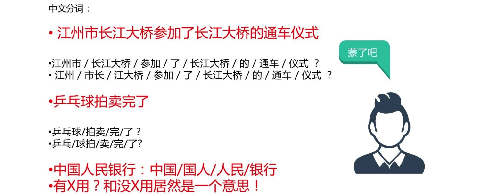
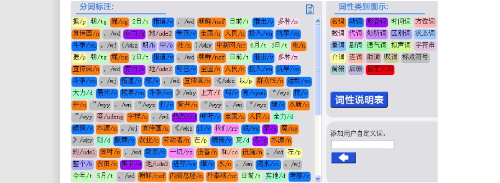
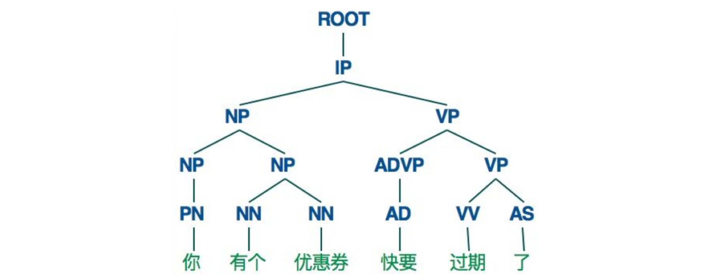
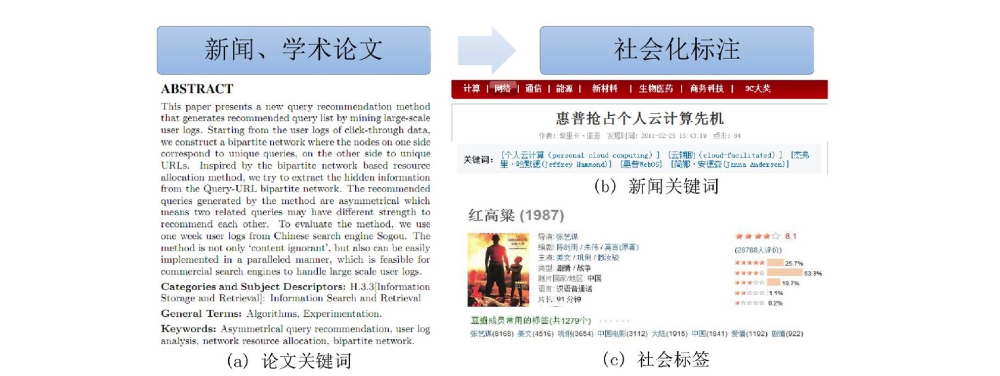
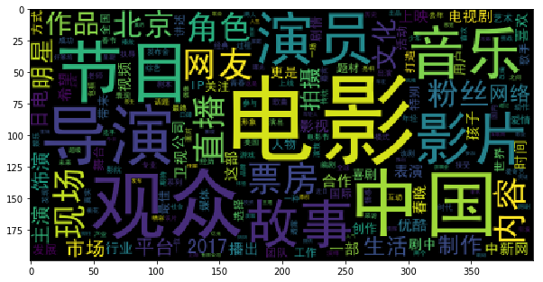
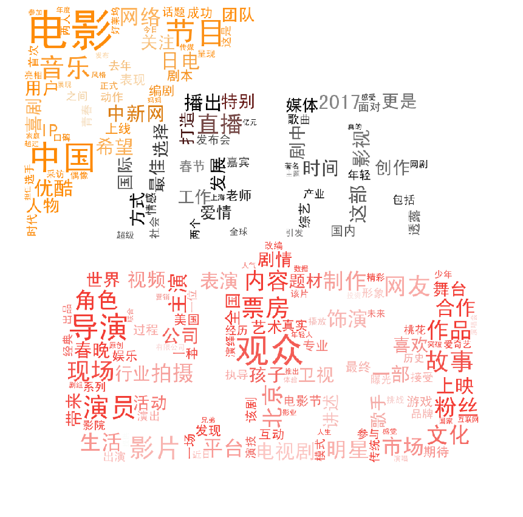

# 中文文本基本任务与处理
#### \[稀牛学院 x 网易云课程\]《AI工程师(自然语言处理方向)》课程资料 by [@寒小阳](https://blog.csdn.net/han_xiaoyang)

### 1.分词
对于中文和日文这样的特殊亚洲语系文本而言，字和字之间是紧密相连的，单纯从文本形态上无法区分具备独立含义的词（拉丁语系纯天然由空格分隔不同的word），而不同的词以不同的方式排布，可以表达不同的内容和情感，因此在很多中文任务中，我们需要做的第一个处理叫做**分词**。

这是一个非常基础的功能，但是会较大程度影响下游任务(机器翻译、情感分析、文本理解)的效果。

目前主流的分词方法主要是**基于词典匹配的分词方法(正向最大匹配法、逆向最大匹配法和双向匹配分词法等)**和**基于统计的分词方法(HMM、CRF、和深度学习)**；主流的分词工具库包括 中科院计算所NLPIR、哈工大LTP、清华大学THULAC、Hanlp分词器、Python jieba工具库等。

关于分词方法和工具库更多内容可以参考知乎讨论[有哪些比较好的中文分词方案](https://www.zhihu.com/question/19578687)



### 2.停用词与N-gram
##### \[稀牛学院 x 网易云课程\]《AI工程师(自然语言处理方向)》课程资料 by [@寒小阳](https://blog.csdn.net/han_xiaoyang)

##### 停用词
> 在自然语言处理的很多任务中，我们处理的主体“文本”中有一些功能词经常出现，然而对于最后的任务目标并没有帮助，甚至会对统计方法带来一些干扰，我们把这类词叫做**停用词**，通常我们会用一个停用词表把它们过滤出来。比如英语当中的**定冠词/不定冠词**(a,an,the等)。

> 中文当中常用到的停用词词表可以参见[中文常用停用词表](https://github.com/goto456/stopwords)

>关于机器学习中停用词的产出与收集方法，大家可以参见知乎讨论[机器学习中如何收集停用词](https://www.zhihu.com/question/34939177)

##### N-gram
>N-gram在中文中叫做n元语法，指文本中连续出现的n个语词。n元语法模型是基于(n-1)阶马尔可夫链的一种概率语言模型，通过n个语词出现的概率来推断语句的结构。关于语言模型的更多内容，我们在后续的课程会详细提到。

>大家可以简单理解成N-gram是N个词条组成的n元组，也可以阅读[自然语言处理中N-Gram模型介绍](https://zhuanlan.zhihu.com/p/32829048)了解更多内容。

### 3.更多任务(词性标注、依赖分析、NER、关键词抽取)
##### \[稀牛学院 x 网易云课程\]《AI工程师(自然语言处理方向)》课程资料 by [@寒小阳](https://blog.csdn.net/han_xiaoyang)

##### 词性标注
> 词性（part-of-speech）是词汇基本的语法属性，通常也称为词性。

> 词性标注（part-of-speech tagging）,又称为词类标注或者简称标注，是指为分词结果中的每个单词标注一个正确的词性的程序，也即确定每个词是名词、动词、形容词或者其他词性的过程。

> 词性标注是很多NLP任务的预处理步骤，如句法分析，经过词性标注后的文本会带来很大的便利性，但也不是不可或缺的步骤。



|代码|名称|说明|举例| 
| :------ | :------ | :------ | :------ | 
| a | 形容词 | 取英语形容词adjective的第1个字母 | 最/d 大/a 的/u| 
| ad | 副形词 | 直接作状语的形容词.形容词代码a和副词代码d并在一起 | 一定/d 能够/v 顺利/ad 实现/v 。/w| 
| ag | 形语素 | 形容词性语素。形容词代码为a，语素代码ｇ前面置以a | 喜/v 煞/ag 人/n| 
| an | 名形词 | 具有名词功能的形容词。形容词代码a和名词代码n并在一起 | 人民/n 的/u 根本/a 利益/n 和/c 国家/n 的/u 安稳/an 。/w| 
| b | 区别词 | 取汉字“别”的声母 | 副/b 书记/n 王/nr 思齐/nr| 
| c | 连词 | 取英语连词conjunction的第1个字母 | 全军/n 和/c 武警/n 先进/a 典型/n 代表/n| 
| d | 副词 | 取adverb的第2个字母，因其第1个字母已用于形容词 | 两侧/f 台柱/n 上/ 分别/d 雄踞/v 着/u| 
| dg | 副语素 |  副词性语素。副词代码为d，语素代码ｇ前面置以d | 用/v 不/d 甚/dg 流利/a 的/u 中文/nz 主持/v 节目/n 。/w| 
| e | 叹词 | 取英语叹词exclamation的第1个字母 | 嗬/e ！/w| 
| f | 方位词 | 取汉字“方” 的声母 | 从/p 一/m 大/a 堆/q 档案/n 中/f 发现/v 了/u| 
| g | 语素 | 绝大多数语素都能作为合成词的“词根”，取汉字“根”的声母 | 例如dg 或ag| 
| h | 前接成分 | 取英语head的第1个字母 | 目前/t 各种/r 非/h 合作制/n 的/u 农产品/n| 
| i | 成语 | 取英语成语idiom的第1个字母 | 提高/v 农民/n 讨价还价/i 的/u 能力/n 。/w| 
| j | 简称略语 | 取汉字“简”的声母 | 民主/ad 选举/v 村委会/j 的/u 工作/vn| 
| k | 后接成分 |   | 权责/n 明确/a 的/u 逐级/d 授权/v 制/k| 
| l | 习用语 | 习用语尚未成为成语，有点“临时性”，取“临”的声母 | 是/v 建立/v 社会主义/n 市场经济/n 体制/n 的/u 重要/a 组成部分/l 。/w| 
| m | 数词 | 取英语numeral的第3个字母，n，u已有他用 | 科学技术/n 是/v 第一/m 生产力/n| 
| n | 名词 | 取英语名词noun的第1个字母 | 希望/v 双方/n 在/p 市政/n 规划/vn| 
| ng | 名语素 | 名词性语素。名词代码为n，语素代码ｇ前面置以n | 就此/d 分析/v 时/Ng 认为/v| 
| nr | 人名 | 名词代码n和“人(ren)”的声母并在一起 | 建设部/nt 部长/n 侯/nr 捷/nr| 
| ns | 地名 | 名词代码n和处所词代码s并在一起 | 北京/ns 经济/n 运行/vn 态势/n 喜人/a| 
| nt | 机构团体 | “团”的声母为t，名词代码n和t并在一起 | [冶金/n 工业部/n 洛阳/ns 耐火材料/l 研究院/n]nt| 
| nx | 字母专名 |   | ＡＴＭ/nx 交换机/n| 
| nz | 其他专名 | “专”的声母的第1个字母为z，名词代码n和z并在一起 | 德士古/nz 公司/n| 
| o | 拟声词 | 取英语拟声词onomatopoeia的第1个字母 | 汩汩/o 地/u 流/v 出来/v| 
| p | 介词 | 取英语介词prepositional的第1个字母 | 往/p 基层/n 跑/v 。/w| 
| q | 量词 | 取英语quantity的第1个字母 | 不止/v 一/m 次/q 地/u 听到/v ，/w| 
| r | 代词 | 取英语代词pronoun的第2个字母,因p已用于介词 | 有些/r 部门/n| 
| s | 处所词 | 取英语space的第1个字母 | 移居/v 海外/s 。/w| 
| t | 时间词 | 取英语time的第1个字母 | 当前/t 经济/n 社会/n 情况/n| 
| tg | 时语素 | 时间词性语素。时间词代码为t,在语素的代码g前面置以t | 秋/Tg 冬/tg 连/d 旱/a| 
| u | 助词 | 取英语助词auxiliary 的第2个字母,因a已用于形容词 | 工作/vn 的/u 政策/n| 
| ud | 结构助词 |   | 有/v 心/n 栽/v 得/ud 梧桐树/n| 
| ug | 时态助词 |   | 你/r 想/v 过/ug 没有/v| 
| uj | 结构助词的 |   | 迈向/v 充满/v 希望/n 的/uj 新/a 世纪/n| 
| ul | 时态助词了 |   | 完成/v 了/ ul| 
| uv | 结构助词地 |   | 满怀信心/l 地/uv 开创/v 新/a 的/u 业绩/n| 
| uz | 时态助词着 |   | 眼看/v 着/uz| 
| v | 动词 |   | 举行/v 老/a 干部/n 迎春/vn 团拜会/n| 
| vd | 副动词 |   | 强调/vd 指出/v| 
| vg | 动语素 | 动词性语素。动词代码为v。在语素的代码g前面置以V | 做好/v 尊/vg 干/j 爱/v 兵/n 工作/vn| 
| vn | 名动词 |  指具有名词功能的动词。动词和名词的代码并在一起 | 股份制/n 这种/r 企业/n 组织/vn 形式/n ，/w| 
| w | 标点符号 |   | 生产/v 的/u ５Ｇ/nx 、/w ８Ｇ/nx 型/k 燃气/n 热水器/n| 
| x | 非语素字 | 非语素字只是一个符号，字母x通常用于代表未知数、符号 |  | 
| y | 语气词 | 取汉字“语”的声母 | 已经/d ３０/m 多/m 年/q 了/y 。/w| 
| z | 状态词 | 取汉字“状”的声母的前一个字母 | 势头/n 依然/z 强劲/a ；/w| 

##### 句法依存分析
在很多复杂的NLP问题中，我们还需要完成句法分析的任务，更具体一点说，需要**确定句子的句法结构**，**确定句子中各词之间的依存关系。**下图为Stanford nlp parser解析得到的结果(对分完词后的句子)



##### 命名实体识别
命名实体识别（Named Entity Recognition, NER）是从一段非结构化文本中找出相关实体（triplet中的主词和宾词），并标注出其位置以及类型，它是NLP领域中一些复杂任务（如**关系抽取**、**信息检索**、**知识问答**、**知识图谱**等）的基础。


##### 关键词抽取
文本关键词抽取，是对文本信息进行高度凝练的一种有效手段，通过3-5个词语准确概括文本的主题，帮助读者快速理解文本信息。是文本检索、文本摘要等许多下游文本挖掘任务的基础性和必要性的工作。


### 4.jieba工具库使用
##### \[稀牛学院 x 网易云课程\]《AI工程师(自然语言处理方向)》课程资料 by [@寒小阳](https://blog.csdn.net/han_xiaoyang)

#### a.基本分词函数与用法
jieba.cut 以及 jieba.cut_for_search 返回的结构都是一个可迭代的 generator，可以使用 for 循环来获得分词后得到的每一个词语(unicode)

**jieba.cut** 方法接受三个输入参数: 
* 需要分词的字符串
* cut_all 参数用来控制是否采用全模式
* HMM 参数用来控制是否使用 HMM 模型


**jieba.cut_for_search** 方法接受两个参数
* 需要分词的字符串
* 是否使用 HMM 模型。

该方法适合用于搜索引擎构建倒排索引的分词，粒度比较细


```python
# encoding=utf-8
import jieba

seg_list = jieba.cut("我在网易云课堂学习自然语言处理", cut_all=True)
print("Full Mode: " + "/ ".join(seg_list))  # 全模式

seg_list = jieba.cut("我在网易云课堂学习自然语言处理", cut_all=False)
print("Default Mode: " + "/ ".join(seg_list))  # 精确模式

seg_list = jieba.cut("他毕业于北京航空航天大学，在百度深度学习研究院进行研究")  # 默认是精确模式
print(", ".join(seg_list))

seg_list = jieba.cut_for_search("小明硕士毕业于中国科学院计算所，后在斯坦福大学深造")  # 搜索引擎模式
print(", ".join(seg_list))
```

    Building prefix dict from the default dictionary ...
    Dumping model to file cache /tmp/jieba.cache
    Loading model cost 1.774 seconds.
    Prefix dict has been built succesfully.
    

    Full Mode: 我/ 在/ 网易/ 云/ 课堂/ 学习/ 自然/ 自然语言/ 语言/ 处理
    Default Mode: 我/ 在/ 网易/ 云/ 课堂/ 学习/ 自然语言/ 处理
    他, 毕业, 于, 北京航空航天大学, ，, 在, 百度, 深度, 学习, 研究院, 进行, 研究
    小明, 硕士, 毕业, 于, 中国, 科学, 学院, 科学院, 中国科学院, 计算, 计算所, ，, 后, 在, 福大, 大学, 斯坦福, 斯坦福大学, 深造
    

可以使用**jieba.lcut**以及**jieba.lcut_for_search**直接返回 list


```python
print(jieba.lcut("我在网易云课堂学习自然语言处理"))
print(jieba.lcut_for_search("小明硕士毕业于中国科学院计算所，后在斯坦福大学深造"))
```

    ['我', '在', '网易', '云', '课堂', '学习', '自然语言', '处理']
    ['小明', '硕士', '毕业', '于', '中国', '科学', '学院', '科学院', '中国科学院', '计算', '计算所', '，', '后', '在', '福大', '大学', '斯坦福', '斯坦福大学', '深造']
    

**添加用户自定义字典**

很多时候我们需要针对自己的场景进行分词，会有一些领域内的专有词汇。
* 1.可以用jieba.load_userdict(file_name)加载用户字典
* 2.少量的词汇可以自己用下面方法手动添加：
    * 用 add_word(word, freq=None, tag=None) 和 del_word(word) 在程序中动态修改词典
    * 用 suggest_freq(segment, tune=True) 可调节单个词语的词频，使其能（或不能）被分出来。


```python
print('/'.join(jieba.cut('如果放到旧字典中将出错。', HMM=False)))
```

    如果/放到/旧/字典/中将/出错/。
    


```python
jieba.suggest_freq(('中', '将'), True)
print('/'.join(jieba.cut('如果放到旧字典中将出错。', HMM=False)))
```

    如果/放到/旧/字典/中/将/出错/。
    

#### b.词性标注


```python
import jieba.posseg as pseg
words = pseg.cut("我在网易云课堂学习自然语言处理")
for word, flag in words:
    print('%s %s' % (word, flag))
```

    我 r
    在 p
    网易 n
    云 ns
    课堂 n
    学习 v
    自然语言 l
    处理 v
    

#### c.关键词抽取
- **基于 TF-IDF 算法的关键词抽取**
    - import jieba.analyse

    * jieba.analyse.extract_tags(sentence, topK=20, withWeight=False, allowPOS=())
        * sentence 为待提取的文本
        * topK 为返回几个 TF/IDF 权重最大的关键词，默认值为 20
        * withWeight 为是否一并返回关键词权重值，默认值为 False
        * allowPOS 仅包括指定词性的词，默认值为空，即不筛选


```python
import jieba.analyse as analyse
lines = open('data/NBA.txt', encoding='utf8').read()
print("  ".join(analyse.extract_tags(lines, topK=20, withWeight=False, allowPOS=())))
```

    韦少  杜兰特  全明星  全明星赛  MVP  威少  正赛  科尔  投篮  勇士  球员  斯布鲁克  更衣柜  NBA  三连庄  张卫平  西部  指导  雷霆  明星队
    


```python
lines = open('data/novel.txt', encoding='utf8').read()
print("  ".join(analyse.extract_tags(lines, topK=20, withWeight=False, allowPOS=())))
```

    行者  八戒  师父  三藏  唐僧  大圣  沙僧  妖精  菩萨  和尚  那怪  那里  长老  呆子  徒弟  怎么  不知  老孙  国王  一个
    

* **关于TF-IDF 算法的关键词抽取补充**
    * **阅读材料:[TF-IDF与关键词提取](http://www.ruanyifeng.com/blog/2013/03/tf-idf.html)**
    * 关键词提取所使用逆向文件频率（IDF）文本语料库可以切换成自定义语料库的路径

        * 用法： jieba.analyse.set_idf_path(file_name) # file_name为自定义语料库的路径
            * 自定义语料库示例见[这里](https://github.com/fxsjy/jieba/blob/master/extra_dict/idf.txt.big)
            * 用法示例见[这里](https://github.com/fxsjy/jieba/blob/master/test/extract_tags_idfpath.py)
        * 关键词提取所使用停止词（Stop Words）文本语料库可以切换成自定义语料库的路径
            * 用法： jieba.analyse.set_stop_words(file_name) # file_name为自定义语料库的路径
            * 自定义语料库示例见[这里](https://github.com/fxsjy/jieba/blob/master/extra_dict/stop_words.txt)
            * 用法示例见[这里](https://github.com/fxsjy/jieba/blob/master/test/extract_tags_stop_words.py)

    * 关键词一并返回关键词权重值示例
        * 用法示例见[这里](https://github.com/fxsjy/jieba/blob/master/test/extract_tags_with_weight.py)

* **基于 TextRank 算法的关键词抽取**
    * jieba.analyse.textrank(sentence, topK=20, withWeight=False, allowPOS=('ns', 'n', 'vn', 'v')) 直接使用，接口相同，注意默认过滤词性。
    * jieba.analyse.TextRank() 新建自定义 TextRank 实例

* 算法论文： [TextRank: Bringing Order into Texts](http://web.eecs.umich.edu/~mihalcea/papers/mihalcea.emnlp04.pdf)

* 基本思想:
    * 将待抽取关键词的文本进行分词
    * 以固定窗口大小(默认为5，通过span属性调整)，词之间的共现关系，构建图
    * 计算图中节点的PageRank，注意是无向带权图
* 阅读资料：
    * [基于textrank的关键词抽取方法](https://blog.csdn.net/zhangf666/article/details/77841845)
    * [pagerank算法核心思想](https://www.jianshu.com/p/f6d66ab97332)
    * [浅析PageRank算法](http://blog.codinglabs.org/articles/intro-to-pagerank.html)


```python
import jieba.analyse as analyse
lines = open('data/NBA.txt', encoding='utf8').read()
print("  ".join(analyse.textrank(lines, topK=20, withWeight=False, allowPOS=('ns', 'n', 'vn', 'v'))))
print("---------------------我是分割线----------------")
print("  ".join(analyse.textrank(lines, topK=20, withWeight=False, allowPOS=('ns', 'n'))))
```

    全明星赛  勇士  正赛  指导  对方  投篮  球员  没有  出现  时间  威少  认为  看来  结果  相隔  助攻  现场  三连庄  介绍  嘉宾
    ---------------------我是分割线----------------
    勇士  正赛  全明星赛  指导  投篮  玩命  时间  对方  现场  结果  球员  嘉宾  时候  全队  主持人  全程  大伙  肥皂剧  照片  目标
    


```python
lines = open('data/novel.txt', encoding='utf8').read()
print("  ".join(analyse.textrank(lines, topK=20, withWeight=False, allowPOS=('ns', 'n', 'vn', 'v'))))
```

    行者  师父  八戒  三藏  大圣  不知  菩萨  妖精  只见  长老  国王  却说  呆子  徒弟  小妖  出来  不得  不见  不能  师徒
    

### 5.python中文文本分析与可视化
##### \[稀牛学院 x 网易云课程\]《AI工程师(自然语言处理方向)》课程资料 by [@寒小阳](https://blog.csdn.net/han_xiaoyang)


```python
import warnings
warnings.filterwarnings("ignore")
import jieba    #分词包
import numpy    #numpy计算包
import codecs   #codecs提供的open方法来指定打开的文件的语言编码，它会在读取的时候自动转换为内部unicode 
import pandas as pd  
import matplotlib.pyplot as plt
%matplotlib inline
import matplotlib
matplotlib.rcParams['figure.figsize'] = (10.0, 5.0)
from wordcloud import WordCloud#词云包
```

##### 读取数据


```python
# pandas读取数据
df = pd.read_csv("./data/entertainment_news.csv", encoding='utf-8').dropna()
# 转成list
content=df["content"].values.tolist()
# 分词与统计词频
segment=[]
for line in content:
    try:
        segs=jieba.lcut(line)
        for seg in segs:
            if len(seg)>1 and seg!='\r\n':
                segment.append(seg)
    except:
        print(line)
        continue
```

##### 去停用词


```python
words_df=pd.DataFrame({'segment':segment})
stopwords=pd.read_csv("data/stopwords.txt",index_col=False,quoting=3,sep="\t",names=['stopword'], encoding='utf-8')#quoting=3全不引用
words_df=words_df[~words_df.segment.isin(stopwords.stopword)]
```

##### 统计排序


```python
words_stat=words_df.groupby(by=['segment'])['segment'].agg({"计数":numpy.size})
words_stat=words_stat.reset_index().sort_values(by=["计数"],ascending=False)
words_stat.head()
```


<div>
<style scoped>
    .dataframe tbody tr th:only-of-type {
        vertical-align: middle;
    }

    .dataframe tbody tr th {
        vertical-align: top;
    }

    .dataframe thead th {
        text-align: right;
    }
</style>
<table border="1" class="dataframe">
  <thead>
    <tr style="text-align: right;">
      <th></th>
      <th>segment</th>
      <th>计数</th>
    </tr>
  </thead>
  <tbody>
    <tr>
      <th>60810</th>
      <td>电影</td>
      <td>10230</td>
    </tr>
    <tr>
      <th>73264</th>
      <td>观众</td>
      <td>5574</td>
    </tr>
    <tr>
      <th>8615</th>
      <td>中国</td>
      <td>5476</td>
    </tr>
    <tr>
      <th>70480</th>
      <td>节目</td>
      <td>4398</td>
    </tr>
    <tr>
      <th>33622</th>
      <td>导演</td>
      <td>4197</td>
    </tr>
  </tbody>
</table>
</div>


##### 构建词云


```python
matplotlib.rcParams['figure.figsize'] = (10.0, 6.0)
wordcloud=WordCloud(font_path="data/simhei.ttf",background_color="black",max_font_size=80)
word_frequence = {x[0]:x[1] for x in words_stat.head(1000).values}
wordcloud=wordcloud.fit_words(word_frequence)
plt.imshow(wordcloud)
```


    <matplotlib.image.AxesImage at 0x7f82628f5240>





##### 自定义背景


```python
from scipy.misc import imread
matplotlib.rcParams['figure.figsize'] = (15.0, 15.0)
from wordcloud import WordCloud,ImageColorGenerator
bimg=imread('image/entertainment.jpeg')
wordcloud=WordCloud(background_color="white",mask=bimg,font_path='data/simhei.ttf',max_font_size=200)
word_frequence = {x[0]:x[1] for x in words_stat.head(1000).values}
wordcloud=wordcloud.fit_words(word_frequence)
bimgColors=ImageColorGenerator(bimg)
plt.axis("off")
plt.imshow(wordcloud.recolor(color_func=bimgColors))
```


    <matplotlib.image.AxesImage at 0x7f826292b5c0>





### 6.新闻关键词抽取
##### \[稀牛学院 x 网易云课程\]《AI工程师(自然语言处理方向)》课程资料 by [@寒小阳](https://blog.csdn.net/han_xiaoyang)

#### TF-IDF


```python
import jieba.analyse as analyse
import pandas as pd
df = pd.read_csv("./data/technology_news.csv", encoding='utf-8').dropna()
lines=df.content.values.tolist()
content = "".join(lines)
print(analyse.extract_tags(content, topK=30, withWeight=False, allowPOS=()))
```

    ['用户', '2016', '互联网', '手机', '平台', '人工智能', '百度', '2017', '智能', '技术', '数据', '360', '服务', '直播', '产品', '企业', '安全', '视频', '移动', '应用', '网络', '行业', '游戏', '机器人', '电商', '内容', '中国', '领域', '通过', '发展']
    


```python
import jieba.analyse as analyse
import pandas as pd
df = pd.read_csv("./data/military_news.csv", encoding='utf-8').dropna()
lines=df.content.values.tolist()
content = "".join(lines)
print(analyse.extract_tags(content, topK=30, withWeight=False, allowPOS=()))
```

    ['航母', '训练', '海军', '中国', '官兵', '部队', '编队', '作战', '10', '任务', '美国', '导弹', '能力', '20', '2016', '军事', '无人机', '装备', '进行', '记者', '我们', '军队', '安全', '保障', '12', '战略', '军人', '日本', '南海', '战机']
    

#### TextRank


```python
import jieba.analyse as analyse
import pandas as pd
df = pd.read_csv("./data/military_news.csv", encoding='utf-8')
df = df.dropna()
lines=df.content.values.tolist()
content = "".join(lines)

print(analyse.textrank(content, topK=20, withWeight=False, allowPOS=('ns', 'n', 'vn', 'v')))
print("---------------------我是分割线----------------")
print(analyse.textrank(content, topK=20, withWeight=False, allowPOS=('ns', 'n')))
```

    ['中国', '海军', '训练', '美国', '部队', '进行', '官兵', '航母', '作战', '任务', '能力', '军事', '发展', '工作', '国家', '问题', '建设', '导弹', '编队', '记者']
    ---------------------我是分割线----------------
    ['中国', '海军', '美国', '部队', '官兵', '航母', '军事', '国家', '任务', '能力', '导弹', '技术', '问题', '日本', '军队', '编队', '装备', '系统', '记者', '战略']
    


