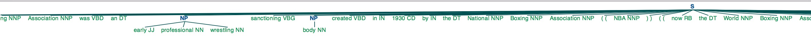

# 英文文本处理与[NLTK](https://www.nltk.org/)
#### \[稀牛学院 x 网易云课程\]《AI工程师(自然语言处理方向)》课程资料 by [@寒小阳](https://blog.csdn.net/han_xiaoyang)

[NLTK](https://www.nltk.org/)，全称Natural Language Toolkit，自然语言处理工具包，是NLP研究领域常用的一个Python库，由宾夕法尼亚大学的Steven Bird和Edward Loper在Python的基础上开发的一个模块，至今已有超过十万行的代码。这是一个开源项目，包含数据集、Python模块、教程等；NLTK是最常用的英文自然语言处理python基础库之一。


### 1.英文Tokenization(标记化/分词)
##### \[稀牛学院 x 网易云课程\]《AI工程师(自然语言处理方向)》课程资料 by [@寒小阳](https://blog.csdn.net/han_xiaoyang)
>文本是不能成段送入模型中进行分析的，我们通常会把文本切成有独立含义的字、词或者短语，这个过程叫做tokenization，这通常是大家解决自然语言处理问题的第一步。在NLTK中提供了2种不同方式的tokenization，sentence tokenization 和 word tokenization，前者把文本进行“断句”，后者对文本进行“分词”。


```python
import nltk
from nltk import word_tokenize, sent_tokenize
import matplotlib
matplotlib.use('Agg')
```


```python
# 读入数据
corpus = open('./data/text.txt','r').read()
# 查看类型
print("corpus的数据类型为:",type(corpus))
```

    corpus的数据类型为: <class 'str'>
    


```python
# 断句
sentences = sent_tokenize(corpus)
sentences
```


    ["A ``knowledge engineer'' interviews experts in a certain domain and tries to embody their knowledge in a computer program for carrying out some task.",
     'How well this works depends on whether the intellectual mechanisms required for the task are within the present state of AI.',
     'When this turned out not to be so, there were many disappointing results.',
     'One of the first expert systems was MYCIN in 1974, which diagnosed bacterial infections of the blood and suggested treatments.',
     'It did better than medical students or practicing doctors, provided its limitations were observed.',
     'Namely, its ontology included bacteria, symptoms, and treatments and did not include patients, doctors, hospitals, death, recovery, and events occurring in time.',
     'Its interactions depended on a single patient being considered.',
     'Since the experts consulted by the knowledge engineers knew about patients, doctors, death, recovery, etc., it is clear that the knowledge engineers forced what the experts told them into a predetermined framework.',
     'In the present state of AI, this has to be true.',
     'The usefulness of current expert systems depends on their users having common sense.']


```python
# 分词
words = word_tokenize(corpus)
words[:20]
```


    ['A',
     '``',
     'knowledge',
     'engineer',
     "''",
     'interviews',
     'experts',
     'in',
     'a',
     'certain',
     'domain',
     'and',
     'tries',
     'to',
     'embody',
     'their',
     'knowledge',
     'in',
     'a',
     'computer']


### 2.停用词
##### \[稀牛学院 x 网易云课程\]《AI工程师(自然语言处理方向)》课程资料 by [@寒小阳]
> 在自然语言处理的很多任务中，我们处理的主体“文本”中有一些功能词经常出现，然而对于最后的任务目标并没有帮助，甚至会对统计方法带来一些干扰，我们把这类词叫做**停用词**，通常我们会用一个停用词表把它们过滤出来。比如英语当中的**定冠词/不定冠词**(a,an,the等)。

>关于机器学习中停用词的产出与收集方法，大家可以参见知乎讨论[机器学习中如何收集停用词](https://www.zhihu.com/question/34939177)


```python
# 导入内置停用词
from nltk.corpus import stopwords
```


```python
stop_words = stopwords.words('english')
#看头10个
stop_words[0:10]
```


    ['i', 'me', 'my', 'myself', 'we', 'our', 'ours', 'ourselves', 'you', "you're"]


```python
# 使用列表推导式去掉停用词
filtered_corpus = [w for w in words if not w in stop_words]
filtered_corpus[:20]
```


    ['A',
     '``',
     'knowledge',
     'engineer',
     "''",
     'interviews',
     'experts',
     'certain',
     'domain',
     'tries',
     'embody',
     'knowledge',
     'computer',
     'program',
     'carrying',
     'task',
     '.',
     'How',
     'well',
     'works']


```python
# 查看停用词数量
print("我们总共剔除的停用词数量为：", len(words)-len(filtered_corpus))
```

    我们总共剔除的停用词数量为： 72
    

### 词性标注
##### \[稀牛学院 x 网易云课程\]《AI工程师(自然语言处理方向)》课程资料 by [@寒小阳]

>词性（part-of-speech）是词汇基本的语法属性，通常也称为词性。

>词性标注（part-of-speech tagging）,又称为词类标注或者简称标注，是指为分词结果中的每个单词标注一个正确的词性的程序，也即确定每个词是名词、动词、形容词或者其他词性的过程。

>词性标注是很多NLP任务的预处理步骤，如句法分析，经过词性标注后的文本会带来很大的便利性，但也不是不可或缺的步骤。
>词性标注的最简单做法是选取最高频词性，主流的做法可以分为基于规则和基于统计的方法，包括：
* 基于最大熵的词性标注
* 基于统计最大概率输出词性
* 基于HMM的词性标注


```python
# 词性标注
from nltk import pos_tag
tags = pos_tag(filtered_corpus)
tags[:20]
```


    [('A', 'DT'),
     ('``', '``'),
     ('knowledge', 'NN'),
     ('engineer', 'NN'),
     ("''", "''"),
     ('interviews', 'NNS'),
     ('experts', 'NNS'),
     ('certain', 'JJ'),
     ('domain', 'NN'),
     ('tries', 'NNS'),
     ('embody', 'VBP'),
     ('knowledge', 'JJ'),
     ('computer', 'NN'),
     ('program', 'NN'),
     ('carrying', 'NN'),
     ('task', 'NN'),
     ('.', '.'),
     ('How', 'WRB'),
     ('well', 'RB'),
     ('works', 'VBZ')]


具体的词性标注编码和含义见如下对应表：

| POS Tag | Description | Example |
| --- | --- | --- |
| CC | coordinating conjunction | and |
| CD | cardinal number | 1, third |
| DT | determiner | the |
| EX | existential there | there, is |
| FW | foreign word | d’hoevre |
| IN | preposition or subordinating conjunction | in, of, like |
| JJ | adjective | big |
| JJR | adjective, comparative | bigger |
| JJS | adjective, superlative | biggest |
| LS | list marker | 1) |
| MD | modal | could, will |
| NN | noun, singular or mass | door |
| NNS | noun plural | doors |
| NNP | proper noun, singular | John |
| NNPS | proper noun, plural | Vikings |
| PDT | predeterminer | both the boys |
| POS | possessive ending | friend‘s |
| PRP | personal pronoun | I, he, it |
| PRP$ | possessive pronoun | my, his |
| RB | adverb | however, usually, naturally, here, good |
| RBR | adverb, comparative | better |
| RBS | adverb, superlative | best |
| RP | particle | give up |
| TO | to | to go, to him |
| UH | interjection | uhhuhhuhh |
| VB | verb, base form | take |
| VBD | verb, past tense | took |
| VBG | verb, gerund or present participle | taking |
| VBN | verb, past participle | taken |
| VBP | verb, sing. present, non-3d | take |
| VBZ | verb, 3rd person sing. present | takes |
| WDT | wh-determiner | which |
| WP | wh-pronoun | who, what |
| WP\$ | possessive wh-pronoun | whose |
| WRB | wh-abverb | where, when |

### 3.chunking/组块分析
##### \[稀牛学院 x 网易云课程\]《AI工程师(自然语言处理方向)》课程资料 by [@寒小阳]

分块是命名实体识别的基础，词性给出来的句子成分的属性，但有时候，更多的信息(比如句子句法结构)可以帮助我们对句子中的模式挖掘更充分。举个例子，”古天乐赞助了很多小学“中的头部古天乐是一个人名(命名实体)

组块分析是一个非常有用的从文本抽取信息的方法，提取组块需要用到正则表达式：


```python
from nltk.chunk import RegexpParser
from nltk import sent_tokenize,word_tokenize
```


```python
# 写一个匹配名词的模式
pattern = """
    NP: {<JJ>*<NN>+}
    {<JJ>*<NN><CC>*<NN>+}
    """
```


```python
# 定义组块分析器
chunker = RegexpParser(pattern)
```


```python
# 一段文本
text = """
he National Wrestling Association was an early professional wrestling sanctioning body created in 1930 by 
the National Boxing Association (NBA) (now the World Boxing Association, WBA) as an attempt to create
a governing body for professional wrestling in the United States. The group created a number of "World" level 
championships as an attempt to clear up the professional wrestling rankings which at the time saw a number of 
different championships promoted as the "true world championship". The National Wrestling Association's NWA 
World Heavyweight Championship was later considered part of the historical lineage of the National Wrestling 
Alliance's NWA World Heavyweight Championship when then National Wrestling Association champion Lou Thesz 
won the National Wrestling Alliance championship, folding the original championship into one title in 1949."""
```


```python
# 分句
tokenized_sentence = nltk.sent_tokenize(text)
# 分词
tokenized_words = [nltk.word_tokenize(sentence) for sentence in tokenized_sentence]
# 词性标注
tagged_words = [nltk.pos_tag(word) for word in tokenized_words]
# 识别NP组块
word_tree = [chunker.parse(word) for word in tagged_words]
```


```python
# 本功能底层非matplotlib实现，无法在不可跳出弹窗的环境中使用，云平台不可使用，请本地尝试
# 示例如下方图片所示

# word_tree[0].draw() # 会跳出弹窗，显示如下的解析图
```



### 4.命名实体识别
##### \[稀牛学院 x 网易云课程\]《AI工程师(自然语言处理方向)》课程资料 by [@寒小阳]

命名实体识别（Named Entity Recognition，简称NER），又称作“专名识别”，是指识别文本中具有特定意义的实体，主要包括人名、地名、机构名、专有名词等。通常包括两部分：1) 实体边界识别；2) 确定实体类别（人名、地名、机构名或其他）。


```python
from nltk import ne_chunk, pos_tag,  word_tokenize
sentence = "John studies at Stanford University."
print(ne_chunk(pos_tag(word_tokenize(sentence))))
```

    (S
      (PERSON John/NNP)
      studies/NNS
      at/IN
      (ORGANIZATION Stanford/NNP University/NNP)
      ./.)
    

命名实体识别也非常推荐大家使用 <a href="https://stanfordnlp.github.io/CoreNLP/">stanford core nlp modules</a> 作为nltk的NER工具库，通常来说它速度更快，而且有更改的识别准确度。

### 5.Stemming和Lemmatizing 
##### \[稀牛学院 x 网易云课程\]《AI工程师(自然语言处理方向)》课程资料 by [@寒小阳]

很多时候我们需要对英文当中的时态语态等做归一化，这个时候我们就需要stemming和lemmatizing这样的操作了。比如"running"是进行时，但是这个词表征的含义和"run"是一致的，我们在识别语义的时候，希望能消除这种差异化。


```python
# 可以用PorterStemmer
from nltk.stem import PorterStemmer
stemmer = PorterStemmer()
stemmer.stem("running")
```


    'run'


```python
stemmer.stem("makes")
```


    'make'


```python
stemmer.stem("swimming")
```


    'swim'


```python
# 也可以用
from nltk.stem import SnowballStemmer
stemmer2 = SnowballStemmer("english")
stemmer2.stem("growing")
```


    'grow'


```python
# Lemmatization和Stemmer很类似，不同的地方在于它还考虑了词义关联等信息
# Stemmer的速度更快，但是它通常只是一系列的规则
from nltk.stem import WordNetLemmatizer
lemmatizer = WordNetLemmatizer()
lemmatizer.lemmatize("makes")
```


    'make'


### 6.WordNet与词义解析
##### \[稀牛学院 x 网易云课程\]《AI工程师(自然语言处理方向)》课程资料 by [@寒小阳]


```python
from nltk.corpus import wordnet as wn
wn.synsets('man')
```


    [Synset('man.n.01'),
     Synset('serviceman.n.01'),
     Synset('man.n.03'),
     Synset('homo.n.02'),
     Synset('man.n.05'),
     Synset('man.n.06'),
     Synset('valet.n.01'),
     Synset('man.n.08'),
     Synset('man.n.09'),
     Synset('man.n.10'),
     Synset('world.n.08'),
     Synset('man.v.01'),
     Synset('man.v.02')]


```python
# 第一种词义
wn.synsets('man')[0].definition()
```


    'an adult person who is male (as opposed to a woman)'


```python
# 第二种词义
wn.synsets('man')[1].definition()
```


    'someone who serves in the armed forces; a member of a military force'


```python
wn.synsets('dog')
```


    [Synset('dog.n.01'),
     Synset('frump.n.01'),
     Synset('dog.n.03'),
     Synset('cad.n.01'),
     Synset('frank.n.02'),
     Synset('pawl.n.01'),
     Synset('andiron.n.01'),
     Synset('chase.v.01')]


```python
# 查词义
wn.synsets('dog')[0].definition()
```


    'a member of the genus Canis (probably descended from the common wolf) that has been domesticated by man since prehistoric times; occurs in many breeds'


```python
# 造句
dog = wn.synset('dog.n.01')
dog.examples()[0]
```


    'the dog barked all night'


```python
# 上位词
dog.hypernyms()
```


    [Synset('canine.n.02'), Synset('domestic_animal.n.01')]


