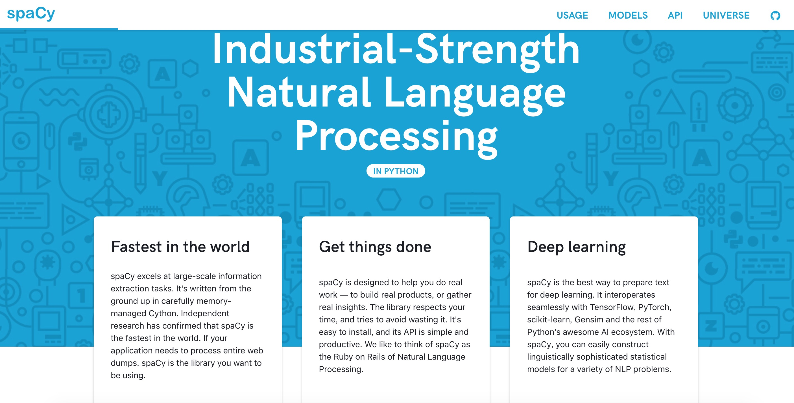

# 英文文本处理与[spaCy](https://spacy.io/)
#### \[稀牛学院 x 网易云课程\]《AI工程师(自然语言处理方向)》课程资料 by [@寒小阳](https://blog.csdn.net/han_xiaoyang)

[spaCy](https://spacy.io/)是Python和Cython中的高级自然语言处理库，它建立在最新的研究基础之上，从一开始就设计用于实际产品。spaCy 带有预先训练的统计模型和单词向量，目前支持 20 多种语言的标记。它具有世界上速度最快的句法分析器，用于标签的卷积神经网络模型，解析和命名实体识别以及与深度学习整合。



### 0.英文Tokenization(标记化/分词)
##### \[稀牛学院 x 网易云课程\]《AI工程师(自然语言处理方向)》课程资料 by [@寒小阳]
>文本是不能成段送入模型中进行分析的，我们通常会把文本切成有独立含义的字、词或者短语，这个过程叫做tokenization，这通常是大家解决自然语言处理问题的第一步。在spaCY中同样可以很方便地完成Tokenization。


```python
import spacy
nlp = spacy.load('en')
doc = nlp('Hello World! My name is HanXiaoyang')
for token in doc:
    print('"' + token.text + '"')
```

    "Hello"
    "World"
    "!"
    "My"
    "name"
    "is"
    "HanXiaoyang"
    

每个token对象有着非常丰富的属性，如下的方式可以取出其中的部分属性。


```python
doc = nlp("Next week I'll   be in Shanghai.")
for token in doc:
    print("{0}\t{1}\t{2}\t{3}\t{4}\t{5}\t{6}\t{7}".format(
        token.text,
        token.idx,
        token.lemma_,
        token.is_punct,
        token.is_space,
        token.shape_,
        token.pos_,
        token.tag_
    ))
```

    Next	0	next	False	False	Xxxx	ADJ	JJ
    week	5	week	False	False	xxxx	NOUN	NN
    I	10	-PRON-	False	False	X	PRON	PRP
    'll	11	will	False	False	'xx	VERB	MD
      	15	  	False	True	  	SPACE	_SP
    be	17	be	False	False	xx	VERB	VB
    in	20	in	False	False	xx	ADP	IN
    Shanghai	23	shanghai	False	False	Xxxxx	PROPN	NNP
    .	31	.	True	False	.	PUNCT	.
    

断句功能在spaCy中也有体现，如下


```python
# 断句
doc = nlp("Hello World! My name is HanXiaoyang")
for sent in doc.sents:
    print(sent)
```

    Hello World!
    My name is HanXiaoyang
    

### 1.词性标注
##### \[稀牛学院 x 网易云课程\]《AI工程师(自然语言处理方向)》课程资料 by [@寒小阳]
>词性（part-of-speech）是词汇基本的语法属性，通常也称为词性。

>词性标注（part-of-speech tagging）,又称为词类标注或者简称标注，是指为分词结果中的每个单词标注一个正确的词性的程序，也即确定每个词是名词、动词、形容词或者其他词性的过程。

>词性标注是很多NLP任务的预处理步骤，如句法分析，经过词性标注后的文本会带来很大的便利性，但也不是不可或缺的步骤。
>词性标注的最简单做法是选取最高频词性，主流的做法可以分为基于规则和基于统计的方法，包括：
* 基于最大熵的词性标注
* 基于统计最大概率输出词性
* 基于HMM的词性标注


```python
# 词性标注
doc = nlp("Next week I'll be in Shanghai.")
print([(token.text, token.tag_) for token in doc])
```

    [('Next', 'JJ'), ('week', 'NN'), ('I', 'PRP'), ("'ll", 'MD'), ('be', 'VB'), ('in', 'IN'), ('Shanghai', 'NNP'), ('.', '.')]
    

具体的词性标注编码和含义见如下对应表：

| POS Tag | Description | Example |
| --- | --- | --- |
| CC | coordinating conjunction | and |
| CD | cardinal number | 1, third |
| DT | determiner | the |
| EX | existential there | there, is |
| FW | foreign word | d’hoevre |
| IN | preposition or subordinating conjunction | in, of, like |
| JJ | adjective | big |
| JJR | adjective, comparative | bigger |
| JJS | adjective, superlative | biggest |
| LS | list marker | 1) |
| MD | modal | could, will |
| NN | noun, singular or mass | door |
| NNS | noun plural | doors |
| NNP | proper noun, singular | John |
| NNPS | proper noun, plural | Vikings |
| PDT | predeterminer | both the boys |
| POS | possessive ending | friend‘s |
| PRP | personal pronoun | I, he, it |
| PRP$ | possessive pronoun | my, his |
| RB | adverb | however, usually, naturally, here, good |
| RBR | adverb, comparative | better |
| RBS | adverb, superlative | best |
| RP | particle | give up |
| TO | to | to go, to him |
| UH | interjection | uhhuhhuhh |
| VB | verb, base form | take |
| VBD | verb, past tense | took |
| VBG | verb, gerund or present participle | taking |
| VBN | verb, past participle | taken |
| VBP | verb, sing. present, non-3d | take |
| VBZ | verb, 3rd person sing. present | takes |
| WDT | wh-determiner | which |
| WP | wh-pronoun | who, what |
| WP\$ | possessive wh-pronoun | whose |
| WRB | wh-abverb | where, when |

### 2.命名实体识别
##### \[稀牛学院 x 网易云课程\]《AI工程师(自然语言处理方向)》课程资料 by [@寒小阳]
命名实体识别（Named Entity Recognition，简称NER），又称作“专名识别”，是指识别文本中具有特定意义的实体，主要包括人名、地名、机构名、专有名词等。通常包括两部分：1) 实体边界识别；2) 确定实体类别（人名、地名、机构名或其他）。


```python
doc = nlp("Next week I'll be in Shanghai.")
for ent in doc.ents:
    print(ent.text, ent.label_)
```

    Next week DATE
    Shanghai GPE
    


```python
from nltk.chunk import conlltags2tree

doc = nlp("Next week I'll be in Shanghai.")
iob_tagged = [
    (
        token.text, 
        token.tag_, 
        "{0}-{1}".format(token.ent_iob_, token.ent_type_) if token.ent_iob_ != 'O' else token.ent_iob_
    ) for token in doc
]
 
print(iob_tagged)
# 按照nltk.Tree的格式显示
print(conlltags2tree(iob_tagged))
```

    [('Next', 'JJ', 'B-DATE'), ('week', 'NN', 'I-DATE'), ('I', 'PRP', 'O'), ("'ll", 'MD', 'O'), ('be', 'VB', 'O'), ('in', 'IN', 'O'), ('Shanghai', 'NNP', 'B-GPE'), ('.', '.', 'O')]
    (S
      (DATE Next/JJ week/NN)
      I/PRP
      'll/MD
      be/VB
      in/IN
      (GPE Shanghai/NNP)
      ./.)
    

spaCy中包含的命名实体非常丰富，如下例所示：


```python
doc = nlp("I just bought 2 shares at 9 a.m. because the stock went up 30% in just 2 days according to the WSJ")
for ent in doc.ents:
    print(ent.text, ent.label_)
```

    2 CARDINAL
    9 a.m. TIME
    30% PERCENT
    just 2 days DATE
    WSJ ORG
    

还可以用非常漂亮的可视化做显示：


```python
from spacy import displacy
 
doc = nlp('I just bought 2 shares at 9 a.m. because the stock went up 30% in just 2 days according to the WSJ')
displacy.render(doc, style='ent', jupyter=True)
```


<div class="entities" style="line-height: 2.5">I just bought 
<mark class="entity" style="background: #e4e7d2; padding: 0.45em 0.6em; margin: 0 0.25em; line-height: 1; border-radius: 0.35em; box-decoration-break: clone; -webkit-box-decoration-break: clone">
    2
    <span style="font-size: 0.8em; font-weight: bold; line-height: 1; border-radius: 0.35em; text-transform: uppercase; vertical-align: middle; margin-left: 0.5rem">CARDINAL</span>
</mark>
 shares at 
<mark class="entity" style="background: #bfe1d9; padding: 0.45em 0.6em; margin: 0 0.25em; line-height: 1; border-radius: 0.35em; box-decoration-break: clone; -webkit-box-decoration-break: clone">
    9 a.m.
    <span style="font-size: 0.8em; font-weight: bold; line-height: 1; border-radius: 0.35em; text-transform: uppercase; vertical-align: middle; margin-left: 0.5rem">TIME</span>
</mark>
 because the stock went up 
<mark class="entity" style="background: #e4e7d2; padding: 0.45em 0.6em; margin: 0 0.25em; line-height: 1; border-radius: 0.35em; box-decoration-break: clone; -webkit-box-decoration-break: clone">
    30%
    <span style="font-size: 0.8em; font-weight: bold; line-height: 1; border-radius: 0.35em; text-transform: uppercase; vertical-align: middle; margin-left: 0.5rem">PERCENT</span>
</mark>
 in 
<mark class="entity" style="background: #bfe1d9; padding: 0.45em 0.6em; margin: 0 0.25em; line-height: 1; border-radius: 0.35em; box-decoration-break: clone; -webkit-box-decoration-break: clone">
    just 2 days
    <span style="font-size: 0.8em; font-weight: bold; line-height: 1; border-radius: 0.35em; text-transform: uppercase; vertical-align: middle; margin-left: 0.5rem">DATE</span>
</mark>
 according to the 
<mark class="entity" style="background: #7aecec; padding: 0.45em 0.6em; margin: 0 0.25em; line-height: 1; border-radius: 0.35em; box-decoration-break: clone; -webkit-box-decoration-break: clone">
    WSJ
    <span style="font-size: 0.8em; font-weight: bold; line-height: 1; border-radius: 0.35em; text-transform: uppercase; vertical-align: middle; margin-left: 0.5rem">ORG</span>
</mark>
</div>


### 3.chunking/组块分析
##### \[稀牛学院 x 网易云课程\]《AI工程师(自然语言处理方向)》课程资料 by [@寒小阳]
spaCy可以自动检测名词短语，并输出根(root)词，比如下面的"Journal","piece","currencies"


```python
doc = nlp("Wall Street Journal just published an interesting piece on crypto currencies")
for chunk in doc.noun_chunks:
    print(chunk.text, chunk.label_, chunk.root.text)
```

    Wall Street Journal NP Journal
    an interesting piece NP piece
    crypto currencies NP currencies
    

### 4.句法依存解析
##### \[稀牛学院 x 网易云课程\]《AI工程师(自然语言处理方向)》课程资料 by [@寒小阳]
spaCy有着非常强大的句法依存解析功能，可以试试对句子进行解析。


```python
doc = nlp('Wall Street Journal just published an interesting piece on crypto currencies')
 
for token in doc:
    print("{0}/{1} <--{2}-- {3}/{4}".format(
        token.text, token.tag_, token.dep_, token.head.text, token.head.tag_))
```

    Wall/NNP <--compound-- Street/NNP
    Street/NNP <--compound-- Journal/NNP
    Journal/NNP <--nsubj-- published/VBD
    just/RB <--advmod-- published/VBD
    published/VBD <--ROOT-- published/VBD
    an/DT <--det-- piece/NN
    interesting/JJ <--amod-- piece/NN
    piece/NN <--dobj-- published/VBD
    on/IN <--prep-- piece/NN
    crypto/JJ <--compound-- currencies/NNS
    currencies/NNS <--pobj-- on/IN
    


```python
from spacy import displacy
 
doc = nlp('Wall Street Journal just published an interesting piece on crypto currencies')
displacy.render(doc, style='dep', jupyter=True, options={'distance': 90})
```


<svg xmlns="http://www.w3.org/2000/svg" xmlns:xlink="http://www.w3.org/1999/xlink" id="675-0" class="displacy" width="1040" height="272.0" style="max-width: none; height: 272.0px; color: #000000; background: #ffffff; font-family: Arial">
<text class="displacy-token" fill="currentColor" text-anchor="middle" y="182.0">
    <tspan class="displacy-word" fill="currentColor" x="50">Wall</tspan>
    <tspan class="displacy-tag" dy="2em" fill="currentColor" x="50">PROPN</tspan>
</text>

<text class="displacy-token" fill="currentColor" text-anchor="middle" y="182.0">
    <tspan class="displacy-word" fill="currentColor" x="140">Street</tspan>
    <tspan class="displacy-tag" dy="2em" fill="currentColor" x="140">PROPN</tspan>
</text>

<text class="displacy-token" fill="currentColor" text-anchor="middle" y="182.0">
    <tspan class="displacy-word" fill="currentColor" x="230">Journal</tspan>
    <tspan class="displacy-tag" dy="2em" fill="currentColor" x="230">PROPN</tspan>
</text>

<text class="displacy-token" fill="currentColor" text-anchor="middle" y="182.0">
    <tspan class="displacy-word" fill="currentColor" x="320">just</tspan>
    <tspan class="displacy-tag" dy="2em" fill="currentColor" x="320">ADV</tspan>
</text>

<text class="displacy-token" fill="currentColor" text-anchor="middle" y="182.0">
    <tspan class="displacy-word" fill="currentColor" x="410">published</tspan>
    <tspan class="displacy-tag" dy="2em" fill="currentColor" x="410">VERB</tspan>
</text>

<text class="displacy-token" fill="currentColor" text-anchor="middle" y="182.0">
    <tspan class="displacy-word" fill="currentColor" x="500">an</tspan>
    <tspan class="displacy-tag" dy="2em" fill="currentColor" x="500">DET</tspan>
</text>

<text class="displacy-token" fill="currentColor" text-anchor="middle" y="182.0">
    <tspan class="displacy-word" fill="currentColor" x="590">interesting</tspan>
    <tspan class="displacy-tag" dy="2em" fill="currentColor" x="590">ADJ</tspan>
</text>

<text class="displacy-token" fill="currentColor" text-anchor="middle" y="182.0">
    <tspan class="displacy-word" fill="currentColor" x="680">piece</tspan>
    <tspan class="displacy-tag" dy="2em" fill="currentColor" x="680">NOUN</tspan>
</text>

<text class="displacy-token" fill="currentColor" text-anchor="middle" y="182.0">
    <tspan class="displacy-word" fill="currentColor" x="770">on</tspan>
    <tspan class="displacy-tag" dy="2em" fill="currentColor" x="770">ADP</tspan>
</text>

<text class="displacy-token" fill="currentColor" text-anchor="middle" y="182.0">
    <tspan class="displacy-word" fill="currentColor" x="860">crypto</tspan>
    <tspan class="displacy-tag" dy="2em" fill="currentColor" x="860">ADJ</tspan>
</text>

<text class="displacy-token" fill="currentColor" text-anchor="middle" y="182.0">
    <tspan class="displacy-word" fill="currentColor" x="950">currencies</tspan>
    <tspan class="displacy-tag" dy="2em" fill="currentColor" x="950">NOUN</tspan>
</text>

<g class="displacy-arrow">
    <path class="displacy-arc" id="arrow-675-0-0" stroke-width="2px" d="M70,137.0 C70,92.0 130.0,92.0 130.0,137.0" fill="none" stroke="currentColor"/>
    <text dy="1.25em" style="font-size: 0.8em; letter-spacing: 1px">
        <textPath xlink:href="#arrow-675-0-0" class="displacy-label" startOffset="50%" fill="currentColor" text-anchor="middle">compound</textPath>
    </text>
    <path class="displacy-arrowhead" d="M70,139.0 L62,127.0 78,127.0" fill="currentColor"/>
</g>

<g class="displacy-arrow">
    <path class="displacy-arc" id="arrow-675-0-1" stroke-width="2px" d="M160,137.0 C160,92.0 220.0,92.0 220.0,137.0" fill="none" stroke="currentColor"/>
    <text dy="1.25em" style="font-size: 0.8em; letter-spacing: 1px">
        <textPath xlink:href="#arrow-675-0-1" class="displacy-label" startOffset="50%" fill="currentColor" text-anchor="middle">compound</textPath>
    </text>
    <path class="displacy-arrowhead" d="M160,139.0 L152,127.0 168,127.0" fill="currentColor"/>
</g>

<g class="displacy-arrow">
    <path class="displacy-arc" id="arrow-675-0-2" stroke-width="2px" d="M250,137.0 C250,47.0 405.0,47.0 405.0,137.0" fill="none" stroke="currentColor"/>
    <text dy="1.25em" style="font-size: 0.8em; letter-spacing: 1px">
        <textPath xlink:href="#arrow-675-0-2" class="displacy-label" startOffset="50%" fill="currentColor" text-anchor="middle">nsubj</textPath>
    </text>
    <path class="displacy-arrowhead" d="M250,139.0 L242,127.0 258,127.0" fill="currentColor"/>
</g>

<g class="displacy-arrow">
    <path class="displacy-arc" id="arrow-675-0-3" stroke-width="2px" d="M340,137.0 C340,92.0 400.0,92.0 400.0,137.0" fill="none" stroke="currentColor"/>
    <text dy="1.25em" style="font-size: 0.8em; letter-spacing: 1px">
        <textPath xlink:href="#arrow-675-0-3" class="displacy-label" startOffset="50%" fill="currentColor" text-anchor="middle">advmod</textPath>
    </text>
    <path class="displacy-arrowhead" d="M340,139.0 L332,127.0 348,127.0" fill="currentColor"/>
</g>

<g class="displacy-arrow">
    <path class="displacy-arc" id="arrow-675-0-4" stroke-width="2px" d="M520,137.0 C520,47.0 675.0,47.0 675.0,137.0" fill="none" stroke="currentColor"/>
    <text dy="1.25em" style="font-size: 0.8em; letter-spacing: 1px">
        <textPath xlink:href="#arrow-675-0-4" class="displacy-label" startOffset="50%" fill="currentColor" text-anchor="middle">det</textPath>
    </text>
    <path class="displacy-arrowhead" d="M520,139.0 L512,127.0 528,127.0" fill="currentColor"/>
</g>

<g class="displacy-arrow">
    <path class="displacy-arc" id="arrow-675-0-5" stroke-width="2px" d="M610,137.0 C610,92.0 670.0,92.0 670.0,137.0" fill="none" stroke="currentColor"/>
    <text dy="1.25em" style="font-size: 0.8em; letter-spacing: 1px">
        <textPath xlink:href="#arrow-675-0-5" class="displacy-label" startOffset="50%" fill="currentColor" text-anchor="middle">amod</textPath>
    </text>
    <path class="displacy-arrowhead" d="M610,139.0 L602,127.0 618,127.0" fill="currentColor"/>
</g>

<g class="displacy-arrow">
    <path class="displacy-arc" id="arrow-675-0-6" stroke-width="2px" d="M430,137.0 C430,2.0 680.0,2.0 680.0,137.0" fill="none" stroke="currentColor"/>
    <text dy="1.25em" style="font-size: 0.8em; letter-spacing: 1px">
        <textPath xlink:href="#arrow-675-0-6" class="displacy-label" startOffset="50%" fill="currentColor" text-anchor="middle">dobj</textPath>
    </text>
    <path class="displacy-arrowhead" d="M680.0,139.0 L688.0,127.0 672.0,127.0" fill="currentColor"/>
</g>

<g class="displacy-arrow">
    <path class="displacy-arc" id="arrow-675-0-7" stroke-width="2px" d="M700,137.0 C700,92.0 760.0,92.0 760.0,137.0" fill="none" stroke="currentColor"/>
    <text dy="1.25em" style="font-size: 0.8em; letter-spacing: 1px">
        <textPath xlink:href="#arrow-675-0-7" class="displacy-label" startOffset="50%" fill="currentColor" text-anchor="middle">prep</textPath>
    </text>
    <path class="displacy-arrowhead" d="M760.0,139.0 L768.0,127.0 752.0,127.0" fill="currentColor"/>
</g>

<g class="displacy-arrow">
    <path class="displacy-arc" id="arrow-675-0-8" stroke-width="2px" d="M880,137.0 C880,92.0 940.0,92.0 940.0,137.0" fill="none" stroke="currentColor"/>
    <text dy="1.25em" style="font-size: 0.8em; letter-spacing: 1px">
        <textPath xlink:href="#arrow-675-0-8" class="displacy-label" startOffset="50%" fill="currentColor" text-anchor="middle">compound</textPath>
    </text>
    <path class="displacy-arrowhead" d="M880,139.0 L872,127.0 888,127.0" fill="currentColor"/>
</g>

<g class="displacy-arrow">
    <path class="displacy-arc" id="arrow-675-0-9" stroke-width="2px" d="M790,137.0 C790,47.0 945.0,47.0 945.0,137.0" fill="none" stroke="currentColor"/>
    <text dy="1.25em" style="font-size: 0.8em; letter-spacing: 1px">
        <textPath xlink:href="#arrow-675-0-9" class="displacy-label" startOffset="50%" fill="currentColor" text-anchor="middle">pobj</textPath>
    </text>
    <path class="displacy-arrowhead" d="M945.0,139.0 L953.0,127.0 937.0,127.0" fill="currentColor"/>
</g>
</svg>


### 5.词向量使用
##### \[稀牛学院 x 网易云课程\]《AI工程师(自然语言处理方向)》课程资料 by [@寒小阳]
NLP中有一个非常强大的文本表示学习方法叫做word2vec，通过词的上下文学习到词语的稠密向量化表示，同时在这个表示形态下，语义相关的词在向量空间中会比较接近。也有类似`v(爷爷)-v(奶奶) ≈ v(男人)-v(女人)`的关系。

如果大家要使用英文的词向量，需要先下载预先训练好的结果。

命令：!python3 -m spacy download en_core_web_lg

*注：实验平台已预先下载好，可直接调用*


```python
nlp = spacy.load('en_core_web_lg')
print(nlp.vocab['banana'].vector)
```

    [ 2.0228e-01 -7.6618e-02  3.7032e-01  3.2845e-02 -4.1957e-01  7.2069e-02
     -3.7476e-01  5.7460e-02 -1.2401e-02  5.2949e-01 -5.2380e-01 -1.9771e-01
     -3.4147e-01  5.3317e-01 -2.5331e-02  1.7380e-01  1.6772e-01  8.3984e-01
      5.5107e-02  1.0547e-01  3.7872e-01  2.4275e-01  1.4745e-02  5.5951e-01
      1.2521e-01 -6.7596e-01  3.5842e-01 -4.0028e-02  9.5949e-02 -5.0690e-01
     -8.5318e-02  1.7980e-01  3.3867e-01  1.3230e-01  3.1021e-01  2.1878e-01
      1.6853e-01  1.9874e-01 -5.7385e-01 -1.0649e-01  2.6669e-01  1.2838e-01
     -1.2803e-01 -1.3284e-01  1.2657e-01  8.6723e-01  9.6721e-02  4.8306e-01
      2.1271e-01 -5.4990e-02 -8.2425e-02  2.2408e-01  2.3975e-01 -6.2260e-02
      6.2194e-01 -5.9900e-01  4.3201e-01  2.8143e-01  3.3842e-02 -4.8815e-01
     -2.1359e-01  2.7401e-01  2.4095e-01  4.5950e-01 -1.8605e-01 -1.0497e+00
     -9.7305e-02 -1.8908e-01 -7.0929e-01  4.0195e-01 -1.8768e-01  5.1687e-01
      1.2520e-01  8.4150e-01  1.2097e-01  8.8239e-02 -2.9196e-02  1.2151e-03
      5.6825e-02 -2.7421e-01  2.5564e-01  6.9793e-02 -2.2258e-01 -3.6006e-01
     -2.2402e-01 -5.3699e-02  1.2022e+00  5.4535e-01 -5.7998e-01  1.0905e-01
      4.2167e-01  2.0662e-01  1.2936e-01 -4.1457e-02 -6.6777e-01  4.0467e-01
     -1.5218e-02 -2.7640e-01 -1.5611e-01 -7.9198e-02  4.0037e-02 -1.2944e-01
     -2.4090e-04 -2.6785e-01 -3.8115e-01 -9.7245e-01  3.1726e-01 -4.3951e-01
      4.1934e-01  1.8353e-01 -1.5260e-01 -1.0808e-01 -1.0358e+00  7.6217e-02
      1.6519e-01  2.6526e-04  1.6616e-01 -1.5281e-01  1.8123e-01  7.0274e-01
      5.7956e-03  5.1664e-02 -5.9745e-02 -2.7551e-01 -3.9049e-01  6.1132e-02
      5.5430e-01 -8.7997e-02 -4.1681e-01  3.2826e-01 -5.2549e-01 -4.4288e-01
      8.2183e-03  2.4486e-01 -2.2982e-01 -3.4981e-01  2.6894e-01  3.9166e-01
     -4.1904e-01  1.6191e-01 -2.6263e+00  6.4134e-01  3.9743e-01 -1.2868e-01
     -3.1946e-01 -2.5633e-01 -1.2220e-01  3.2275e-01 -7.9933e-02 -1.5348e-01
      3.1505e-01  3.0591e-01  2.6012e-01  1.8553e-01 -2.4043e-01  4.2886e-02
      4.0622e-01 -2.4256e-01  6.3870e-01  6.9983e-01 -1.4043e-01  2.5209e-01
      4.8984e-01 -6.1067e-02 -3.6766e-01 -5.5089e-01 -3.8265e-01 -2.0843e-01
      2.2832e-01  5.1218e-01  2.7868e-01  4.7652e-01  4.7951e-02 -3.4008e-01
     -3.2873e-01 -4.1967e-01 -7.5499e-02 -3.8954e-01 -2.9622e-02 -3.4070e-01
      2.2170e-01 -6.2856e-02 -5.1903e-01 -3.7774e-01 -4.3477e-03 -5.8301e-01
     -8.7546e-02 -2.3929e-01 -2.4711e-01 -2.5887e-01 -2.9894e-01  1.3715e-01
      2.9892e-02  3.6544e-02 -4.9665e-01 -1.8160e-01  5.2939e-01  2.1992e-01
     -4.4514e-01  3.7798e-01 -5.7062e-01 -4.6946e-02  8.1806e-02  1.9279e-02
      3.3246e-01 -1.4620e-01  1.7156e-01  3.9981e-01  3.6217e-01  1.2816e-01
      3.1644e-01  3.7569e-01 -7.4690e-02 -4.8480e-02 -3.1401e-01 -1.9286e-01
     -3.1294e-01 -1.7553e-02 -1.7514e-01 -2.7587e-02 -1.0000e+00  1.8387e-01
      8.1434e-01 -1.8913e-01  5.0999e-01 -9.1960e-03 -1.9295e-03  2.8189e-01
      2.7247e-02  4.3409e-01 -5.4967e-01 -9.7426e-02 -2.4540e-01 -1.7203e-01
     -8.8650e-02 -3.0298e-01 -1.3591e-01 -2.7765e-01  3.1286e-03  2.0556e-01
     -1.5772e-01 -5.2308e-01 -6.4701e-01 -3.7014e-01  6.9393e-02  1.1401e-01
      2.7594e-01 -1.3875e-01 -2.7268e-01  6.6891e-01 -5.6454e-02  2.4017e-01
     -2.6730e-01  2.9860e-01  1.0083e-01  5.5592e-01  3.2849e-01  7.6858e-02
      1.5528e-01  2.5636e-01 -1.0772e-01 -1.2359e-01  1.1827e-01 -9.9029e-02
     -3.4328e-01  1.1502e-01 -3.7808e-01 -3.9012e-02 -3.4593e-01 -1.9404e-01
     -3.3580e-01 -6.2334e-02  2.8919e-01  2.8032e-01 -5.3741e-01  6.2794e-01
      5.6955e-02  6.2147e-01 -2.5282e-01  4.1670e-01 -1.0108e-02 -2.5434e-01
      4.0003e-01  4.2432e-01  2.2672e-01  1.7553e-01  2.3049e-01  2.8323e-01
      1.3882e-01  3.1218e-03  1.7057e-01  3.6685e-01  2.5247e-03 -6.4009e-01
     -2.9765e-01  7.8943e-01  3.3168e-01 -1.1966e+00 -4.7156e-02  5.3175e-01]
    


```python
from scipy import spatial

# 余弦相似度计算
cosine_similarity = lambda x, y: 1 - spatial.distance.cosine(x, y)

# 男人、女人、国王、女王 的词向量
man = nlp.vocab['man'].vector
woman = nlp.vocab['woman'].vector
queen = nlp.vocab['queen'].vector
king = nlp.vocab['king'].vector
 
# 我们对向量做一个简单的计算，"man" - "woman" + "queen"
maybe_king = man - woman + queen
computed_similarities = []

# 扫描整个词库的词向量做比对，召回最接近的词向量
for word in nlp.vocab:
    if not word.has_vector:
        continue
 
    similarity = cosine_similarity(maybe_king, word.vector)
    computed_similarities.append((word, similarity))

# 排序与最接近结果展示
computed_similarities = sorted(computed_similarities, key=lambda item: -item[1])
print([w[0].text for w in computed_similarities[:10]])
```

    ['Queen', 'QUEEN', 'queen', 'King', 'KING', 'king', 'KIng', 'Kings', 'KINGS', 'kings']
    

### 6.词汇与文本相似度
##### \[稀牛学院 x 网易云课程\]《AI工程师(自然语言处理方向)》课程资料 by [@寒小阳]
在词向量的基础上，spaCy提供了从词到文档的相似度计算的方法，下面的例子是它的使用方法。


```python
# 词汇语义相似度(关联性)
banana = nlp.vocab['banana']
dog = nlp.vocab['dog']
fruit = nlp.vocab['fruit']
animal = nlp.vocab['animal']
 
print(dog.similarity(animal), dog.similarity(fruit)) # 0.6618534 0.23552845
print(banana.similarity(fruit), banana.similarity(animal)) # 0.67148364 0.2427285
```

    0.66185343 0.23552851
    0.67148364 0.24272855
    


```python
# 文本语义相似度(关联性)
target = nlp("Cats are beautiful animals.")
 
doc1 = nlp("Dogs are awesome.")
doc2 = nlp("Some gorgeous creatures are felines.")
doc3 = nlp("Dolphins are swimming mammals.")
 
print(target.similarity(doc1))  # 0.8901765218466683
print(target.similarity(doc2))  # 0.9115828449161616
print(target.similarity(doc3))  # 0.7822956752876101
```

    0.8901766262114666
    0.9115828449161616
    0.7822956256736615
    


### 0.安装与配置
手动下载spacy用到的模型（比如英文模型）


```python

!pip install -i https://pypi.tuna.tsinghua.deu.cn/simple spacy --user
!python -m spacy download en
```
