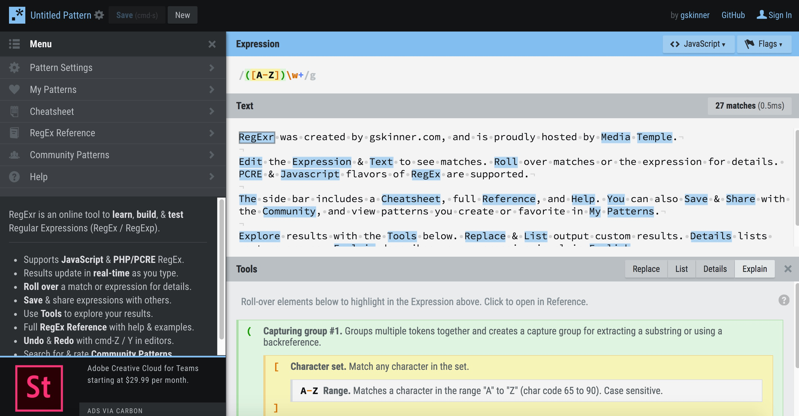

## Python正则表达式
#### \[稀牛学院 x 网易云课程\]《AI工程师(自然语言处理方向)》课程资料 by [@寒小阳](https://blog.csdn.net/han_xiaoyang)

正则表达式是**处理字符串**的强大工具，拥有独特的语法和独立的处理引擎。<br>

我们在大文本中匹配字符串时，有些情况用str自带的函数(比如index, find, in)可能可以完成，有些情况会稍稍复杂一些(比如说找出所有“像邮箱”的字符串，所有和xiniuedu/netease相关的句子)，这个时候我们需要一个某种模式的工具，这个时候**正则表达式**就派上用场了。<br>

自然语言处理的各种模型和算法要发挥作用离不开数据，离不开“干净”的数据，而现实生活中的数据形态和干净程度不一，我们经常要做一些数据清洗和信息抽取的工作，这时候正则表达式就可以发挥及其强大的匹配功能了。说起来，正则表达式是一套引擎，并不是Python语言独有的功能或者工具库，下面我们就来了解一下正则表达式吧。

## 1.学习与验证工具
##### \[稀牛学院 x 网易云课程\]《AI工程师(自然语言处理方向)》课程资料 by [@寒小阳]
我们最喜爱的正则表达式在线验证工具之一是http://regexr.com/ ，大家可以在线的方式学习与验证正则表达式的对错，左边还有对应的工具和速查表。



## 2.正则表达式语法
##### \[稀牛学院 x 网易云课程\]《AI工程师(自然语言处理方向)》课程资料 by [@寒小阳](https://blog.csdn.net/han_xiaoyang)

下面是一张有些同学比较熟的图，我们俗称python正则表达式小抄，大家可以遵循一般字符、预定义字符集、数量词、边界匹配、逻辑分组 和 特殊构造的逻辑去逐步学习。

当你要匹配 **一个/多个/任意个 数字/字母/非数字/非字母/某几个字符/任意字符**，想要 **贪婪/非贪婪** 匹配，想要捕获匹配出来的 **第一个/所有** 内容的时候，记得这里有个小手册供你参考。


## 3.挑战与提升
#### \[稀牛学院 x 网易云课程\]《AI工程师(自然语言处理方向)》课程资料 by [@寒小阳](https://blog.csdn.net/han_xiaoyang)
长期做自然语言处理的同学正则表达式都非常熟，在若干年前硕士刚毕业时曾有一段时间写了大量的正则表达式，以至于同事间开玩笑说，只要是符合某种规律或者模式的串，肯定分分钟能匹配出来。正则表达式属于“短时间内习得且受益终身的技能”

对于想练习正则表达式，或者短期内快速get复杂技能，or想挑战更复杂的正则表达式的同学们。
请戳[正则表达式进阶练习](https://alf.nu/RegexGolf)

各位宝宝enjoy yourself


## 4.Python案例
#### \[稀牛学院 x 网易云课程\]《AI工程师(自然语言处理方向)》课程资料 by [@寒小阳](https://blog.csdn.net/han_xiaoyang)

### re模块
Python通过re模块提供对正则表达式的支持。

使用re的一般步骤是
* 1.将正则表达式的字符串形式编译为Pattern实例
* 2.使用Pattern实例处理文本并获得匹配结果（一个Match实例）
* 3.使用Match实例获得信息，进行其他的操作。


```python
# encoding: UTF-8
import re
 
# 将正则表达式编译成Pattern对象
pattern = re.compile(r'hello.*\!')
 
# 使用Pattern匹配文本，获得匹配结果，无法匹配时将返回None
match = pattern.match('hello, hanxiaoyang! How are you?')
 
if match:
    # 使用Match获得分组信息
    print match.group()
```

    hello, hanxiaoyang!
    

#### re.compile(strPattern[, flag]):

这个方法是Pattern类的工厂方法，用于将字符串形式的正则表达式编译为Pattern对象。 

第二个参数flag是匹配模式，取值可以使用按位或运算符'|'表示同时生效，比如re.I | re.M。

当然，你也可以在regex字符串中指定模式，比如**re.compile('pattern', re.I | re.M)**等价于**re.compile('(?im)pattern')** 

flag可选值有：

* re.I(re.IGNORECASE): 忽略大小写（括号内是完整写法，下同）
* re.M(MULTILINE): 多行模式，改变'^'和'$'的行为（参见上图）
* re.S(DOTALL): 点任意匹配模式，改变'.'的行为
* re.L(LOCALE): 使预定字符类 \w \W \b \B \s \S 取决于当前区域设定
* re.U(UNICODE): 使预定字符类 \w \W \b \B \s \S \d \D 取决于unicode定义的字符属性
* re.X(VERBOSE): 详细模式。这个模式下正则表达式可以是多行，忽略空白字符，并可以加入注释。以下两个正则表达式是等价的：


```python
regex_1 = re.compile(r"""\d +  # 数字部分
                         \.    # 小数点部分
                         \d *  # 小数的数字部分""", re.X)
regex_2 = re.compile(r"\d+\.\d*")
```

### Match

Match对象是一次匹配的结果，包含了很多关于此次匹配的信息，可以使用Match提供的可读属性或方法来获取这些信息。

#### match属性：

* string: 匹配时使用的文本。
* re: 匹配时使用的Pattern对象。
* pos: 文本中正则表达式开始搜索的索引。值与Pattern.match()和Pattern.seach()方法的同名参数相同。
* endpos: 文本中正则表达式结束搜索的索引。值与Pattern.match()和Pattern.seach()方法的同名参数相同。
* lastindex: 最后一个被捕获的分组在文本中的索引。如果没有被捕获的分组，将为None。
* lastgroup: 最后一个被捕获的分组的别名。如果这个分组没有别名或者没有被捕获的分组，将为None。

#### 方法：

* group([group1, …]): <br>
获得一个或多个分组截获的字符串；指定多个参数时将以元组形式返回。group1可以使用编号也可以使用别名；编号0代表整个匹配的子串；不填写参数时，返回group(0)；没有截获字符串的组返回None；截获了多次的组返回最后一次截获的子串。
* groups([default]): <br>
以元组形式返回全部分组截获的字符串。相当于调用group(1,2,…last)。default表示没有截获字符串的组以这个值替代，默认为None。
* groupdict([default]): <br>
返回以有别名的组的别名为键、以该组截获的子串为值的字典，没有别名的组不包含在内。default含义同上。
* start([group]): <br>
返回指定的组截获的子串在string中的起始索引（子串第一个字符的索引）。group默认值为0。
* end([group]): <br>
返回指定的组截获的子串在string中的结束索引（子串最后一个字符的索引+1）。group默认值为0。
* span([group]): <br>
返回(start(group), end(group))。
* expand(template): <br>
将匹配到的分组代入template中然后返回。template中可以使用\id或\g<id>、\g<name>引用分组，但不能使用编号0。\id与\g<id>是等价的；但\10将被认为是第10个分组，如果你想表达\1之后是字符'0'，只能使用\g<1>0。


```python
import re
m = re.match(r'(\w+) (\w+)(?P<sign>.*)', 'hello hanxiaoyang!')
 
print "m.string:", m.string
print "m.re:", m.re
print "m.pos:", m.pos
print "m.endpos:", m.endpos
print "m.lastindex:", m.lastindex
print "m.lastgroup:", m.lastgroup
 
print "m.group(1,2):", m.group(1, 2)
print "m.groups():", m.groups()
print "m.groupdict():", m.groupdict()
print "m.start(2):", m.start(2)
print "m.end(2):", m.end(2)
print "m.span(2):", m.span(2)
print r"m.expand(r'\2 \1\3'):", m.expand(r'\2 \1\3')
```

    m.string: hello hanxiaoyang!
    m.re: <_sre.SRE_Pattern object at 0x10b111be0>
    m.pos: 0
    m.endpos: 18
    m.lastindex: 3
    m.lastgroup: sign
    m.group(1,2): ('hello', 'hanxiaoyang')
    m.groups(): ('hello', 'hanxiaoyang', '!')
    m.groupdict(): {'sign': '!'}
    m.start(2): 6
    m.end(2): 17
    m.span(2): (6, 17)
    m.expand(r'\2 \1\3'): hanxiaoyang hello!
    

### Pattern

Pattern对象是一个编译好的正则表达式，通过Pattern提供的一系列方法可以对文本进行匹配查找。

Pattern不能直接实例化，必须使用re.compile()进行构造。

Pattern提供了几个可读属性用于获取表达式的相关信息：
* pattern: 编译时用的表达式字符串。
* flags: 编译时用的匹配模式。数字形式。
* groups: 表达式中分组的数量。
* groupindex: 以表达式中有别名的组的别名为键、以该组对应的编号为值的字典，没有别名的组不包含在内。


```python
import re
p = re.compile(r'(\w+) (\w+)(?P<sign>.*)', re.DOTALL)
 
print "p.pattern:", p.pattern
print "p.flags:", p.flags
print "p.groups:", p.groups
print "p.groupindex:", p.groupindex
```

    p.pattern: (\w+) (\w+)(?P<sign>.*)
    p.flags: 16
    p.groups: 3
    p.groupindex: {'sign': 3}
    

### 使用pattern

* **match(string[, pos[, endpos]]) | re.match(pattern, string[, flags])**: <br>
**这个方法将从string的pos下标处起尝试匹配pattern**:
    * 如果pattern结束时仍可匹配，则返回一个Match对象
    * 如果匹配过程中pattern无法匹配，或者匹配未结束就已到达endpos，则返回None。 
    * pos和endpos的默认值分别为0和len(string)。 <br>
    **注意：这个方法并不是完全匹配。当pattern结束时若string还有剩余字符，仍然视为成功。想要完全匹配，可以在表达式末尾加上边界匹配符'$'。 **


* **search(string[, pos[, endpos]]) | re.search(pattern, string[, flags])**: <br>
**这个方法从string的pos下标处起尝试匹配pattern**
    * 如果pattern结束时仍可匹配，则返回一个Match对象
    * 若无法匹配，则将pos加1后重新尝试匹配，直到pos=endpos时仍无法匹配则返回None。 
    * pos和endpos的默认值分别为0和len(string))


```python
# encoding: UTF-8 
import re 
 
# 将正则表达式编译成Pattern对象 
pattern = re.compile(r'H.*g') 
 
# 使用search()查找匹配的子串，不存在能匹配的子串时将返回None 
# 这个例子中使用match()无法成功匹配 
match = pattern.search('hello Hanxiaoyang!') 
 
if match: 
    # 使用Match获得分组信息 
    print match.group() 
```

    Hanxiaoyang
    

* **split(string[, maxsplit]) | re.split(pattern, string[, maxsplit]):** 
    * 按照能够匹配的子串将string分割后返回列表。
    * maxsplit用于指定最大分割次数，不指定将全部分割。 


```python
import re
 
p = re.compile(r'\d+')
print p.split('one1two2three3four4')
```

    ['one', 'two', 'three', 'four', '']
    

* **findall(string[, pos[, endpos]]) | re.findall(pattern, string[, flags])**: 
    * 搜索string，以列表形式返回全部能匹配的子串。


```python
import re
 
p = re.compile(r'\d+')
print p.findall('one1two2three3four4')
```

    ['1', '2', '3', '4']
    

* **finditer(string[, pos[, endpos]]) | re.finditer(pattern, string[, flags]): **
    * 搜索string，返回一个顺序访问每一个匹配结果（Match对象）的迭代器。 


```python
import re
 
p = re.compile(r'\d+')
for m in p.finditer('one1two2three3four4'):
    print m.group()
```

    1
    2
    3
    4
    

* **sub(repl, string[, count]) | re.sub(pattern, repl, string[, count]): **
    * 使用repl替换string中每一个匹配的子串后返回替换后的字符串。 
        * 当repl是一个字符串时，可以使用\id或\g<id>、\g<name>引用分组，但不能使用编号0。 
        * 当repl是一个方法时，这个方法应当只接受一个参数（Match对象），并返回一个字符串用于替换（返回的字符串中不能再引用分组）。 
count用于指定最多替换次数，不指定时全部替换。


```python
import re
 
p = re.compile(r'(\w+) (\w+)')
s = 'i say, hello hanxiaoyang!'
 
print p.sub(r'\2 \1', s)
 
def func(m):
    return m.group(1).title() + ' ' + m.group(2).title()
 
print p.sub(func, s)
```

    say i, hanxiaoyang hello!
    I Say, Hello Hanxiaoyang!
    

* **subn(repl, string[, count]) |re.sub(pattern, repl, string[, count]): **
    * 返回 (sub(repl, string[, count]), 替换次数)。


```python
import re
 
p = re.compile(r'(\w+) (\w+)')
s = 'i say, hello hanxiaoyang!'
 
print p.subn(r'\2 \1', s)
 
def func(m):
    return m.group(1).title() + ' ' + m.group(2).title()
 
print p.subn(func, s)
```

    ('say i, hanxiaoyang hello!', 2)
    ('I Say, Hello Hanxiaoyang!', 2)
    


